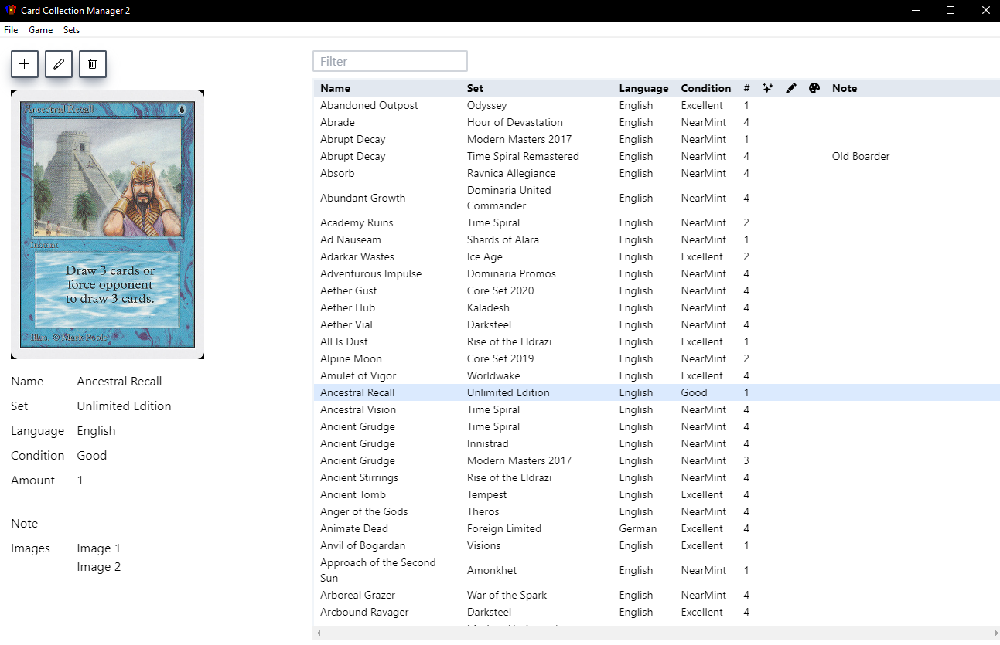
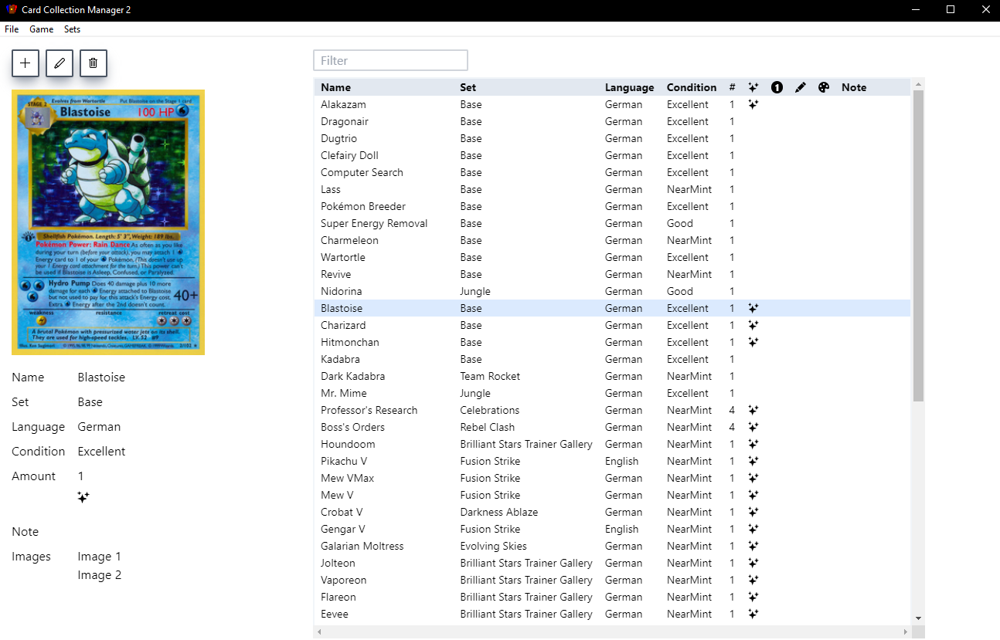

# Card Collection Manager 2



## Project Description
This projects provides a management application for trading card game collections. Its aim is to be a simple solution to keep track of collections. The main reason why I wrote this application is because I required a tool, which can manage single card images of a large collection, besides common card collection management features.

This project is the successor of my previous project [Card Collection Manager](https://github.com/sebastiandine/Card-Collection-Manager). The main benefit over the first version of the project is that this version can support multiple card games at once. Right now, it supports [Magic the Gathering](https://magic.wizards.com/) and the [Pokemon TCG](https://tcg.pokemon.com). The project was designed with extensibility in mind, so adding support for additional games is quite easy (about 2 hours of work per game).

In addition to these functional enhancements, the application was completely rewritten from scratch. While the previous project was Java-based, this version is based on the [Tauri framework](https://tauri.app/), using Rust and Typescript. Therefore, the application is now available as native binary for all three common platform: Windows, Linux and MacOS.

## Migrate from Card Collection Manager 1
You can migrate your Magic the Gathering collection from CCM1 to CCM2 by following these steps:
1. Create a JSON export of your collection in CCM1 (`Export -> to JSON (.json)`)
2. Copy this file to `<cc2_collection_dir>/magic/collection.json`, where `<cc2_collection_dir>` is the root collection directory of your CCM2 instance. By default, this will be the directory where CCM2 is installed, but you can also specify an arbitrary directory via the CCM2 settings dialog (`File -> Settings`).
3. Copy all image files of your collection from `<cc1_collection_dir>/images/` to `<cc2_collection_dir>/magic/images/`, where `<cc1_collection_dir>` is the root collection directory of your CCM1 instance.

After performing these steps, the next time you open CCM2, you will see your collection in CCM2. Now, you can delete CCM1.


## How to build/ contribute
### Contribute
The project includes configuration for [VSCode development containers](https://code.visualstudio.com/docs/remote/containers) which should be the preffered environment to develop new features of the app. The container automatically sets up a whole Tauri development environment including Typescript & Rust plugins for VSCode.

Also, in directory `hooks/` you find some helpful git hooks that automate/standardize some work. You can activate these hooks by executing the script `activate_hooks.sh` from within the `hooks/` directory. If you are receiving errors like `fatal: cannot run .git/hooks/pre-commit: No such file or directory`, check the line-end sequence of the hook scripts, adjust them according to your system and run `activate_hooks.sh` again. The hooks are especially useful for versioning. They ensure that the version number in each of the 3 manifest files are the same and create a `version` file with the current version at the project's root level, which can be picked up easily by automated CI/CD tasks.

Additionally, if you want to run the GUI out of the container, you need to use a X11 tool. I will briefly explain how to run them in order to display the GUI from the container:

**Windows**<br>
I recommend [Xming](https://sourceforge.net/projects/xming/) if your host system is Windows ([VcXSrv](https://sourceforge.net/projects/vcxsrv/), which I recommended for the Java-based CCM1 did not work here). Once you have it installed, start it via `Xming.exe` and enable the option `Disable access control` before you start the server. Now, you can start a GUI app in your container that will be displayed via the X-server on the host system.

**MacOS**<br>
Install [XQuartz](https://www.xquartz.org/) and run it via the following command:
```
xhost +localhost
```
Now, you can start a GUI app in your container that will be displayed via the X-server on the host system.

### Local Run & Building
* Execute  `yarn` to install all NodeJS dependencies when you initially check out the project. Make sure you are in the Tauri project directory.
* Execute `yarn tauri dev` to run the application in development mode. Make sure you are in the Tauri project directory. If you run this for the first time, this will take quite a long time, since it needs to fetch all Rust-based dependencies and build corresponding binaries. If you make changes to the Rust code of the project, it will also take a while (but not as long as the initial run), since it has to recompile binaries.
* Execute `yarn tauri build`  to build the application. Right now, Tauri only supports building for the local architecture. Since the development container is based on Linux, this means you will build Linux packages via this command.

### Remote Building
Actual versions are automatically built via GitHub Action pipelines defined at [`.github/workflows`](./.github/workflows/).

## Toolkit
### Base
* [Tauri](https://tauri.app/) framework with [Rust](https://www.rust-lang.org/) for backend/internal logic and [Typescript](https://www.typescriptlang.org/) for the UI. 

### Frontend (TS)
* [Next.JS](https://nextjs.org/) as UI framework.
* [Tailwind CSS](https://tailwindcss.com/) for UI component styling.
* [React Icons](https://react-icons.github.io/react-icons/)
* [React Spinner](https://mhnpd.github.io/react-loader-spinner/docs/intro)

### Backend (Rust)
* [serde](https://crates.io/crates/serde) for data serialization/deserialization.
* [serde_json](https://crates.io/crates/serde_json) for data serialization/deserialization to and from JSON.
* [image](https://crates.io/crates/image) to work with image files.
* [base64](https://crates.io/crates/base64) to convert image files to base64 encoded strings to send them from backend to frontend.
* [reqwest](https://crates.io/crates/reqwest) for REST calls to game-specific APIs to fetch set and card data.
* [strum](https://crates.io/crates/strum) for additional macros for enums and strings.
* [nom](https://crates.io/crates/nom) for type checks.

### Additional Resources
* [Scryfall API](https://scryfall.com/docs/api) for fetching card and set data of Magic the Gathering, including card preview images.
* [Pokemon TCG API](https://docs.pokemontcg.io/) for fetching card and set data of the Pokemon TCG, including card preview images.

### Further Reading
* [Tauri GitHub Actions Templates](https://github.com/tauri-apps/tauri-action)
* [Rust Serialization Framework](https://github.com/serde-rs/serde)
* [Tauri Command Docs](https://tauri.app/v1/guides/features/command)
